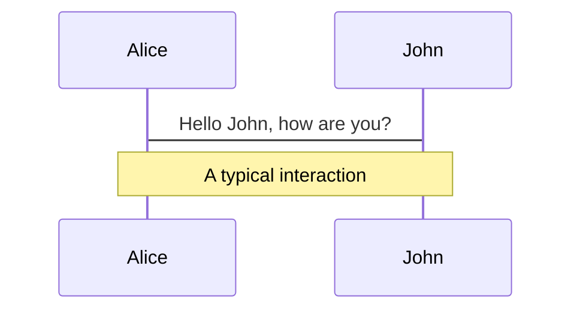
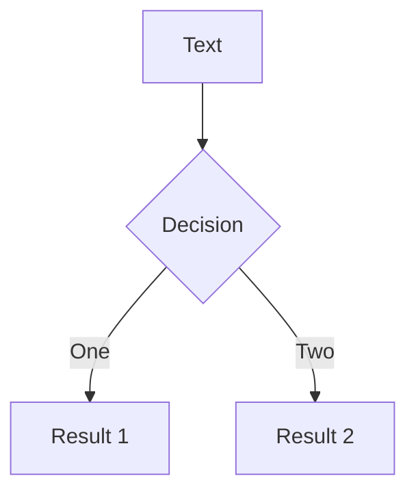

---
relates:
  - Mermaid: https://mermaid.js.org/
  - Mermaid Live Editor: https://mermaid.live/
  - Demo Slide: https://sli.dev/demo/starter/12
  - features/plantuml
tags: [ダイアグラム]
description: |
  Mermaid を使用して、テキスト記述からダイアグラム/グラフを作成します。
---

# Mermaid ダイアグラム

Mermaid を使用して、マークダウン内のテキスト記述からダイアグラムやグラフを作成できます。

コードブロックに `mermaid` とマークすると、ダイアグラムに変換されます。例えば:

````md

````

さらに、オプションオブジェクトを渡してスケーリングやテーマを指定することもできます。オブジェクトの構文は JavaScript のオブジェクトリテラルで、文字列には引用符（`'`）を付け、キーの間はカンマ（`,`）で区切る必要があります。

````md

````

詳しくは、[Mermaid の公式サイト](https://mermaid.js.org/) をご覧ください。
