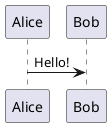

---
relates:
  - Plant UML: https://plantuml.com/
  - Plant UML Live Editor: https://plantuml.com/plantuml
  - Example side: https://sli.dev/demo/starter/12
  - features/mermaid
tags: [ダイアグラム]
description: |
  PlantUML を使って、テキスト記述からダイアグラムを作成します。
---

# PlantUML ダイアグラム

スライド内で簡単に PlantUML ダイアグラムを作成できます。例えば:

````md

````

デフォルトでソースコードを https://www.plantuml.com/plantuml に送信してダイアグラムをレンダリングします。独自のサーバーを設定することもできます。[Slidev の設定](../custom/index#headmatter) で `plantUmlServer` を設定してください。

[PlantUML のウェブサイト](https://plantuml.com/) も参照してください。
